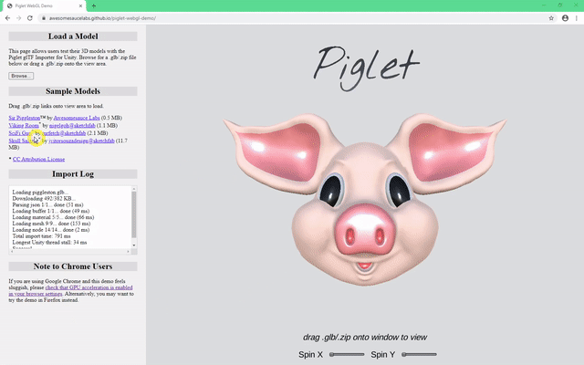
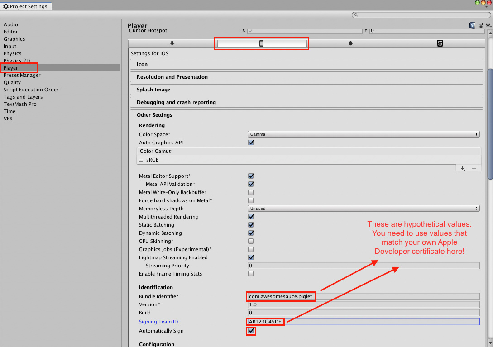
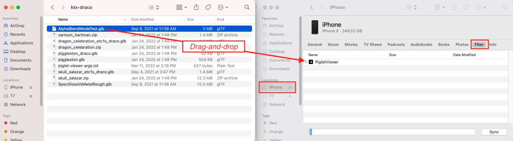

# Table of Contents

* [Description](#description)
* [Live Demo](#live-demo)
* [Known Issues](#known-issues)
* [Build Instructions](#build-instructions)
  * [Unity Project Setup](#unity-project-setup)
  * [Standalone Build Instructions (Windows/Mac/Linux)](#standalone-build-instructions-windowsmaclinux)
  * [Android Build Instructions](#android-build-instructions)
  * [iOS Build Instructions](#ios-build-instructions)
  * [WebGL Build Instructions](#webgl-build-instructions)
* [Command Line Options](#command-line-options)
  * [Using Command Line Options on Android/iOS/WebGL](#using-command-line-options-on-androidioswebgl)
* [Navigating the Source Code](#navigating-the-source-code)
* [Licenses and Attributions](#licenses-and-attributions)
* [Footnotes](#footnotes)

# Description


<br>
*Viewing ["SciFi Gun"](https://sketchfab.com/3d-models/scifi-gun-04a9f3ccb5b14dc38a28b27c1916e18e) by [mrfetch@sketchfab](https://sketchfab.com/mrfetch) in the [live PigletViewer demo](https://awesomesaucelabs.github.io/piglet-webgl-demo/).*

PigletViewer is a Unity application which uses the [Piglet glTF Importer](https://assetstore.unity.com/packages/slug/173425) to load and view 3D models from glTF files (`.gltf`, `.glb`, or `.zip`)<sup>[1](#footnote1)</sup>. It is designed to run on multiple platforms and currently supports builds for Windows, macOS, Android, iOS, and WebGL (see [Build Instructions](#build-instructions)).

PigletViewer is provided as an example application for customers of the [Piglet glTF Importer](https://assetstore.unity.com/packages/slug/173425). As such, building the application requires purchasing and installing Piglet from the Unity Asset Store. For new users of Piglet, I recommend watching the [Runtime Import Tutorial video](https://youtu.be/f66wmgSTPI0) and/or reading the [Runtime Import Tutorial section of the manual](https://awesomesaucelabs.github.io/piglet-manual/#runtime-import-tutorial) before exploring the PigletViewer code, as the tutorial provides a much quicker and simpler introduction to the API.

# Live Demo

A live demo for the WebGL version of PigletViewer is available at: [https://awesomesaucelabs.github.io/piglet-webgl-demo/](https://awesomesaucelabs.github.io/piglet-webgl-demo/). I have tested the demo in Firefox and Google Chrome<sup>[2](#footnote2)</sup>, on Windows 10 64-bit.

# Known Issues

**Drag-and-drop functionality does not work on MacOS or Linux**. The
ability to drag-and-drop .gltf/.glb/.zip files into the PigletViewer
window only works on Windows, because I implemented that feature using
[UnityWindowsFileDragAndDrop](https://github.com/Bunny83/UnityWindowsFileDrag-Drop). On
MacOS or Linux, you will instead need to use the `--import` option
(see [command line options](#command-line-options)) to choose which
glTF file(s) are loaded on application startup.

# Build Instructions

## Unity Project Setup

To set up the Unity project for PigletViewer, I recommend the following steps:

1. Create a new project using Unity version 2018.4.20f1 or newer.
2. Purchase and install the [Piglet glTF Importer](https://assetstore.unity.com/packages/slug/173425) asset from the Unity Asset Store.
3. Download the latest `.unitypackage` for PigletViewer from the [releases page](https://github.com/AwesomesauceLabs/piglet-viewer/releases), then unpack the `.unitypackage` into your project from `Assets -> Import Package -> Custom Package...` in the Unity menu. 

I recommend installing from the `.unitypackage` rather than doing a `git clone` because the project in this repo is tied to Unity version 2018.4.20f1, whereas the `.unitypackage` will also work with newer versions of Unity.

## Standalone Build Instructions (Windows/Mac/Linux)

You can build PigletViewer for Windows/Mac/Linux using the following steps:

1. Double-click `Assets/PigletViewer/Scenes/MainScene.unity` to make it the current scene.
2. Click `File -> Build Settings...` in the Unity menu.
3. Click `PC, Mac & Linux Standalone` on the left sidebar of the `Build Settings` dialog.
4. Change the active build target to `PC, Mac & Linux Standalone` by clicking `Switch Platform`. The `Switch Platform` button will be grayed out if `PC, Mac & Linux Standalone` is already the active build target.
5. Click `Build And Run`.
6. Select a location for the output files and click `OK` to start the build.

Once the build has completed, PigletViewer will open on your Windows/Mac/Linux desktop. If you are using Windows, you can drag-and-drop `.gltf`/`.glb`/`.zip` files onto the PigletViewer window to view them. If you are using Mac or Linux, you will instead need to launch PigletViewer from the command line and use the `--import` option to specify which glTF file(s) to load at startup (see [command line options](#command-line-options)). 

## Android Build Instructions

Before you can build Android apps with Unity, you will first need to
install **Android Build Support** via Unity Hub. See [Android
environment
setup](https://docs.unity3d.com/Manual/android-sdksetup.html) from the
Unity documentation for instructions.

You will also need to enable **USB debugging** on your Android
phone/tablet. See [Configure on-device developer
options](https://developer.android.com/studio/debug/dev-options) from
the Android documentation for instructions.

Once you have completed the above steps, you can build and run PigletViewer on Android using the following steps: 

1. Double-click `Assets/PigletViewer/Scenes/MainScene.unity` to make it the current scene.
2. Click `File -> Build Settings...` in the Unity menu.
3. Click `Android` on the left sidebar of the `Build Settings` dialog.
4. Change the active build target to `Android` by clicking `Switch Platform`. The `Switch Platform` button will be grayed out if `Android` is already the active build target.
5. Click `Build and Run`.
6. Select a location for the output `.apk` file and click `OK` to start the build.

Unity will automatically upload and run the `.apk` file on your Android phone/tablet once the build has completed. (You may need to wake/unlock your Android device before the PigletViewer app will start.)

You can open glTF files in the PigletViewer app by opening `.glb`/`.zip` files from a file browser app and choosing PigletViewer as the target application<sup>[3](#footnote3)</sup>.

## iOS Build Instructions

In comparison to other platforms (e.g. Windows, Android), building for iOS has a lot of additional steps and requirements. Most importantly:

1. You need to run the Unity build on a Mac computer (e.g. MacBook, Mac Mini). If you don't already own a Mac computer, you may be able to avoid purchasing one by using [Unity Cloud Build](https://unity.com/features/cloud-build) for iOS builds, but I've never tried that myself.
2. You need to join the [Apple Developer Program](https://developer.apple.com/programs/enroll/). As of March 2022, an Apple Developer membership costs $119.00 USD/year.

Even if you use Unity Cloud Build for iOS builds, you will still need to pay the yearly Apple Developer fee in order to generate the required iOS app-signing certificate, as described below.

Once you have obtained a Mac computer and bought an Apple Developer subscription, the next steps are:

1. Install Unity on your Mac computer using Unity Hub, and add the **iOS Build Support** module during the installation. (See [Add modules](https://docs.unity3d.com/hub/manual/AddModules.html) from the Unity Hub documentation for instructions.)
2. Install [Xcode](https://developer.apple.com/xcode/) on your Mac computer using the Apple App Store.
3. Create an iOS app-signing certificate using the Apple Developer website, by following the steps described in [Building for iOS](https://docs.unity3d.com/Manual/UnityCloudBuildiOS.html) from the Unity documentation. Although the instructions refer to Unity Cloud Build, the same steps must be followed to perform iOS builds on your local Mac machine.

*Whew*. Generating those certificate files was long and confusing process, wasn't it? Don't worry, you're almost done now.

Next you need configure iOS app-signing in Unity, as depicted in the screenshot below.


<br>
*Screenshot of Unity settings for signing iOS apps.*

In detail:

1. Select `Edit -> Project Settings... -> Player -> iOS tab -> Other Settings -> Identification` from the Unity menu.
2. Set `Bundle Identifier` to a name that matches the certificate from the Apple Developer website, as shown under `Certificates, IDs & Profiles -> Identifiers`. For example, for my own Apple Developer account, I have a certificate named "awesomesauce" that is associated with the pattern "com.awesomesauce.*".  So "com.awesomesauce.piglet" would be a valid value for the `Bundle Identifier` field.
3. Set `Signing Team ID` to your Apple Developer team ID. This is the alphanumeric ID shown in the top right corner of your Apple Developer account page, after you select `Certificates, IDs & Profiles`. A hypothetical example is "AB123C45DE".
4. Enable the `Automatically Sign` checkbox.

Finally (!), you can build and run PigletViewer on your iOS device using the following steps:

1. Double-click `Assets/PigletViewer/Scenes/MainScene.unity` to make it the current scene.
2. Click `File -> Build Settings...` in the Unity menu.
3. Click `iOS` on the left sidebar of the `Build Settings` dialog.
4. Change the active build target to `iOS` by clicking `Switch Platform`. The `Switch Platform` button will be grayed out if `iOS` is already the active build target.
5. Click `Build and Run`.
6. Select a location for the output `.app` folder and click `OK` to start the build.

Xcode will automatically upload and run the app on your iPhone/iPad once the build has completed. If you have installed your Apple Developer certificate correctly (see [Building for iOS](https://docs.unity3d.com/Manual/UnityCloudBuildiOS.html)), Xcode will prompt for your Mac login password to sign the app. You may also need to wake/unlock your iPhone/iPad before the PigletViewer app will start running.

Once the app is installed on your iPhone/iPad, you can open a `.glb` or `.zip` file in the app by either:

1. Sharing the file from your Mac to your iPhone/iPad using [AirDrop](https://support.apple.com/en-us/HT204144), **OR**
2. Dragging-and-dropping the file onto the PigletViewer app in Finder, which can be found by clicking `iPhone`/`iPad` in the left sidebar and then selecting the `Files` tab (see screenshot below).


<br>
*Dragging-and-dropping a glTF file onto the PigletViewer iOS app in Finder.*

## WebGL Build Instructions

Before you can build WebGL apps with Unity, you will need to install **WebGL Build Support** via Unity Hub. See [Add modules](https://docs.unity3d.com/hub/manual/AddModules.html) from the Unity Hub documentation for instructions.

Once you have installed WebGL Build Support, you can build and run PigletViewer in a web browser using the following steps:

1. Select the appropriate WebGL Template under `Edit => Project Settings... => Player => WebGL settings tab => Resolution and Presentation => WebGL Template`. For Unity 2018 or Unity 2019, use the `Piglet2018` template. For Unity 2020 or newer, use the `Piglet2020` template<sup>[4](#footnote4)</sup>.
2. Double-click `Assets/PigletViewer/Scenes/MainScene.unity` to make it the current scene.
3. Click `File => Build Settings...` in the Unity menu.
4. Click `WebGL` on the left sidebar of the `Build Settings` dialog.
5. Change the active build target to `WebGL` by clicking `Switch Platform`. The `Switch Platform` button will be grayed out if `WebGL` is already the active build target.
6. Click `Build and Run` in the bottom right corner.
7. Select an output directory for the WebGL build and click `OK`.

Once the build has completed, PigletViewer will open in your default web browser.

## Command Line Options

PigletViewer can be run with command-line options to automatically
import glTF file(s) and perform other actions. For example, the
following command would start the Windows standalone exe, import
`model1.glb`, sleep for 2 seconds, import `model2.glb`, sleep for 2
seconds (again), then quit.

```
PigletViewer.exe -- --import model1.glb --sleep 2 --import model2.glb --sleep 2 --quit
```

:warning: Notice the bare `--` in the example command above. Options
that precede the `--` are [standard Unity Standalone Player command
line
arguments](https://docs.unity3d.com/Manual/PlayerCommandLineArguments.html),
whereas options after the `--` are PigletViewer-specific options (as
listed below).

:warning: Your Windows standalone exe may be named something different
than `PigletViewer.exe`. The name of the executable is determined by the value of
`Product Name` under `Edit -> Project Settings... -> Player -> Product Name`
in the Unity menu.

The full list of the PigletViewer options is:

```
Usage: PigletViewer.exe <UNITY_OPTIONS> -- <PIGLET_VIEWER_OPTIONS>

Options:

-b, --button=LABEL                 Show button with LABEL and continue when user clicks it
-e, --ensure-quaternion-continuity Call AnimationClip.EnsureQuaternionContinuity() after
                                   importing each animation clip.
-i, --import=URI                   Import glTF file from URI (file path or HTTP URL)
-I, --import-streaming-asset=PATH  Import glTF file from PATH, where PATH is relative
                                   to the StreamingAssets folder. This option is useful
                                   because the StreamingAssets folder can be located in
                                   different places depending on the target platform.
                                   For example, on Android the StreamingAssets
                                   folder is located inside the .apk file!
-m, --log-message=MESSAGE          Print message to Unity log
-M, --mipmaps                      Create mipmaps during texture loading [disabled]
-p, --profile                      Enable performance profiling [disabled]. When
                                   enabled, this writes some profiling data
                                   to the Unity log after each glTF import.
-q, --quit                         Quit application after performing all command line
                                   actions [disabled].
-s, --sleep=SECONDS                Sleep for SECONDS seconds. The option is
                                   order-dependent and can be placed between
                                   --import options to introduce a delay between
                                   glTF imports.
```

:warning: I would love to add a `--help` option that prints the above message on STDOUT, but
so far I can't figure out how to do it!

### Using Command Line Options on Android/iOS/WebGL

On Android/iOS/WebGL, specifying command line options is either
awkward or impossible. On these platforms, you can still use command
line options by putting them in a file named
`StreamingAssets/piglet-viewer-args.txt` inside your Unity project.
The options are split on whitespace and can be specified across
multiple lines.

Here is an example of a valid `StreamingAssets/piglet-viewer-args.txt` file:

```
--import https://awesomesaucelabs.github.io/piglet-webgl-demo/StreamingAssets/piggleston.glb
--sleep 2
--import https://awesomesaucelabs.github.io/piglet-webgl-demo/StreamingAssets/dragon_celebration.zip
--sleep 2
--quit
```

:warning: Currently, PigletViewer does naive splitting on whitespace
when parsing `StreamingAssets/piglet-viewer-args.txt`, so quoted arguments
and arguments with spaces are not possible.

On platforms that support it (e.g. Windows, macOS), it is still
possible to use ordinary command line options when there is
`StreamingAssets/piglet-viewer-args.txt` file in your project.
Options specified on the command line are appended to the options
specified in `StreamingAssets/piglet-viewer-args.txt`.

## Navigating the Source Code

The best starting point for understanding the PigletViewer code is the `GameManager` class in [`Assets/PigletViewer/Scripts/GameManager.cs`](Assets/PigletViewer/Scripts/GameManager.cs). This class is responsible for starting glTF import tasks and for setting up callbacks that track import progress, handle import errors, and handle successful completion of a glTF import. `GameManager` also handles running scripts that implement platform-specific behaviour (e.g. `WindowsGameManager`). Depending on the target platform of your game/application, it may be useful to look at those classes as well.

# Licenses and Attributions

The PigletViewer code in this repo is released under an [MIT license](LICENSE).

This repo includes the code for [UnityWindowsFileDragAndDrop](https://github.com/Bunny83/UnityWindowsFileDrag-Drop) under `Assets/PigletViewer/Dependencies/UnityWindowsFileDragDrop`, which also has an [MIT license](Assets/PigletViewer/Dependencies/UnityWindowsFileDragDrop/LICENSE).

Building PigletViewer requires purchasing and installing the [Piglet glTF Importer](https://assetstore.unity.com/packages/slug/173425) source code separately from the Unity Asset Store. Piglet is licensed under the [Unity Asset Store End User License Agreement (EULA)](https://unity3d.com/legal/as_terms). Briefly, this means that you are free use Piglet in your applications and games (commercial or otherwise), but you are not allowed to redistribute the source code.

The "Sir Piggleston" model included at `Assets/StreamingAssets/piggleston.glb` is a trademark for the [Piglet glTF Importer](https://assetstore.unity.com/packages/slug/173425). Please contact `awesomesaucelabs` at gmail for licensing terms.

This repo includes several sample glTF models under `Assets/StreamingAssets`, which have been published by various artists on [Sketchfab](https://sketchfab.com) under the [CC Attribution License](https://creativecommons.org/licenses/by/4.0/):

| Name of Work | Author | License | File Path |
| ------------ | ------ | ------- | --------- |
| ["Morpher Animated Face - Military Cartoon Hartman"](https://sketchfab.com/3d-models/morpher-animated-face-military-cartoon-hartman-538a674c39e24c15965231ab2bdb656a) | [skudgee@sketchfab](https://sketchfab.com/skudgee) | [CC Attribution License](https://creativecommons.org/licenses/by/4.0/) | `Assets/StreamingAssets/cartoon_hartman.zip` |
| ["Skull Salazar"](https://sketchfab.com/3d-models/scifi-gun-04a9f3ccb5b14dc38a28b27c1916e18e) | [jvitorsouzadesign@sketchfab](https://sketchfab.com/jvitorsouzadesign) | [CC Attribution License](https://creativecommons.org/licenses/by/4.0/) | `Assets/StreamingAssets/skull_salazar.zip` |
| ["Dragon (Celebration)"](https://sketchfab.com/3d-models/dragon-celebration-2d0973f9e6514c0d93ec2230d4807dd2) | [kand8998@sketchfab](https://sketchfab.com/KaitlynAndrus) | [CC Attribution License](https://creativecommons.org/licenses/by/4.0/) | `Assets/StreamingAssets/dragon_celebration.zip` |

# Footnotes

<a name="footnote1">1</a>. The WebGL build can only load models from `.glb` and `.zip` files (not `.gltf` files). The main issue with loading `.gltf` files in a web browser is that they typically reference other files on the user's hard drive (e.g. PNG files for textures), and web browsers aren't allowed to load arbitrary files from the user's hard drive, for security reasons.  There is a similar issue for opening `.gltf` files on Android<sup>[3](#footnote3)</sup>.

<a name="footnote2">2</a>. Performance of PigletViewer in Google Chrome can be greatly improved by [enabling hardware acceleration](https://www.lifewire.com/hardware-acceleration-in-chrome-4125122) (i.e. GPU acceleration) in the browser settings. (This option is currently disabled by default in Chrome.)

<a name="footnote3">3</a>. Opening `.gltf` files from file browser apps does not work on Android. The main problem is that the file browser apps send PigletViewer an opaque [content URI]( https://developer.android.com/guide/topics/providers/content-provider-basics#ContentURIs) for the input `.gltf` file, rather than a file path.  This means that PigletViewer cannot resolve relative file paths used inside the `.gltf` file (e.g. paths to PNG files). There is a similar issue for opening `.gltf` files in the WebGL build<sup>[1](#footnote1)</sup>.

<a name="footnote4">4</a>. There are substantial changes to WebGL builds in Unity 2020, which require using a different WebGL template (`Piglet2020`). For a detailed discussion of WebGL-related changes in Unity 2020, see:  [https://forum.unity.com/threads/changes-to-the-webgl-loader-and-templates-introduced-in-unity-2020-1.817698/](https://forum.unity.com/threads/changes-to-the-webgl-loader-and-templates-introduced-in-unity-2020-1.817698/)
